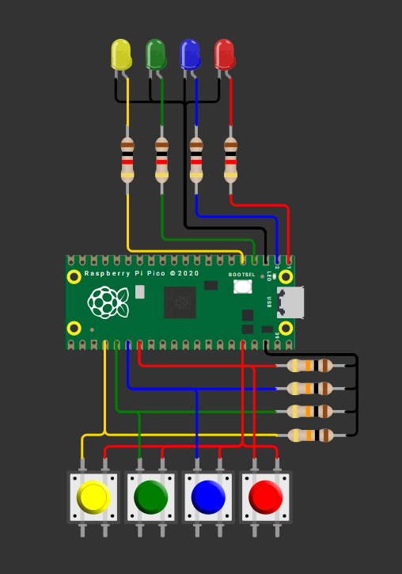

## Simón Dice

Construir un juego Simón Dice de 4 colores en Raspberry Pi Pico 2.

- La secuencia crece +1 por ronda, de 1 hasta 15.

- La persona jugadora debe repetir la secuencia con 4 botones dentro de un tiempo límite por ronda.

- Aleatoriedad obligatoria: la secuencia debe ser impredecible en cada ejecución.

Reglas del juego (obligatorias)

- Encendido/Reset: el 7 segmentos muestra “0” y queda en espera de Start (cualquier botón permite iniciar).

- Reproducción: mostrar la secuencia actual (LEDs uno por uno con separación clara).

- Entrada: al terminar la reproducción, la persona debe repetir la secuencia completa dentro de TL.

- Fallo (Game Over): botón incorrecto, falta/extra de entradas o exceder TL.

- Progresión: si acierta, puntaje = número de ronda, agrega 1 color aleatorio y avanza.

- Fin: al fallar o completar la Ronda 15. Mostrar puntaje final en 7 segmentos (hex).

---

### Esquemático de conexión

Esquemático del circuito usado durante el reto.



---

### Código
```C++
#include "pico/stdlib.h"
#include "hardware/structs/sio.h"
#include <stdlib.h>  //Para la funcion de rand y srand
#include "pico/time.h"// Para utilizar el tiempo
 
 //DEFINIR LOS LEDS Y LOS BOTONES
#define LED_RO 0
#define LED_AZ 1
#define LED_VE 2
#define LED_AM 3
 
#define Boton_RO 21
#define Boton_AZ 20
#define Boton_VE 19
#define Boton_AM 18
 
int Rondas = 15; //Número de rondas
int Secuencia[15];//Tamaño del array para guardar la secuencia
 
int leer_boton() {     //Funcion para leer el boton
    while (true) {
        if (gpio_get(Boton_RO)) {
              while (gpio_get(Boton_RO)){ sleep_ms(10); // Para evitar rebotes se espera y se devuelve el valor del led
              return LED_RO;
            }
        }
        if (gpio_get(Boton_AZ)) {
              while (gpio_get(Boton_AZ)){ sleep_ms(10);
              return LED_AZ;
            }
        }
        if (gpio_get(Boton_VE)) {
              while (gpio_get(Boton_VE)){ sleep_ms(10);
              return LED_VE;
            }
        }
        if (gpio_get(Boton_AM)) {
              while (gpio_get(Boton_AM)){ sleep_ms(10);
              return LED_AM;
            }
        }
    }
}
 
int main() {
    // Inicializar LEDS como salidas
    gpio_init(LED_RO); gpio_set_dir(LED_RO, 1);
    gpio_init(LED_AZ); gpio_set_dir(LED_AZ, 1);
    gpio_init(LED_VE); gpio_set_dir(LED_VE, 1);
    gpio_init(LED_AM); gpio_set_dir(LED_AM, 1);
 
    // Inicializar botones como entradas
    gpio_init(Boton_RO); gpio_set_dir(Boton_RO, 0);
    gpio_init(Boton_AZ); gpio_set_dir(Boton_AZ, 0);
    gpio_init(Boton_VE); gpio_set_dir(Boton_VE, 0);
    gpio_init(Boton_AM); gpio_set_dir(Boton_AM, 0);
 
    //Mientras que ninguno de los botones este presionado, todos los leds van a estar apagados
    while (gpio_get(Boton_RO) == 0 && gpio_get(Boton_AZ) == 0 && gpio_get(Boton_VE) == 0 && gpio_get(Boton_AM) == 0) {
        gpio_put(LED_RO, 0);
        gpio_put(LED_AZ, 0);
        gpio_put(LED_VE, 0);
        gpio_put(LED_AM, 0);
        sleep_ms(1);
    }
 
    //La semilla para los numeros aleatorios usando el tiempo para que nuestra secuencia sea diferente cada vez
    srand(time_us_32());
 
    // Se repite hasta que lleguemos a las 15 rondas    
    for (int i = 0; i < Rondas; i++) {
 
        int led_on = rand() % 4;  // Para que nos de un numero del 0 al 3
 
        if (led_on == 0) Secuencia[i] = LED_RO;  // Se guarda en el array la secuencia, si es 0 es rojo
 
        else if (led_on == 1) Secuencia[i] = LED_AZ;
 
        else if (led_on == 2) Secuencia[i] = LED_VE;
 
        else if (led_on == 3) Secuencia[i] = LED_AM;
    }
 
    bool fallo = false; // Variable para controlar si el jugador ha fallado, false si no ha fallado, true si ha fallado
 
    // Juego principal se repite hasta que se acaben las rondas o haya un fallo
    for (int ronda = 0; ronda < Rondas && !fallo; ronda++) {
        // Se muestra la secuencia, segun lo que se tenga guardado en el array
        for (int i = 0; i <= ronda; i++) {
            int led = Secuencia[i];  // Encender el led correspondiente
            gpio_put(led, 1); sleep_ms(500);
            gpio_put(led, 0); sleep_ms(500);
        }
 
        // El jugador debe repetir la secuencia, se enciende el led que ha pulsado
        for (int i = 0; i <= ronda; i++) {
            int pulsado = leer_boton();
            gpio_put(pulsado, 1); sleep_ms(200);
            gpio_put(pulsado, 0); sleep_ms(100);
 
            // Comprobar si ha fallado la secuencia
            if (pulsado != Secuencia[i]) { //si el led pulsado no es igual al de la secuencia, ha fallado, por lo que se cambia el valor de fallo a true y se sale del bucle
                fallo = true;
                break;
            }
        }
        sleep_ms(800);
    }
 
    // Si hubo fallo, parpadear todos los leds 4 veces
    if (fallo) {
      for (int k = 0; k < 4; k++) {
        gpio_put(LED_RO, 1); gpio_put(LED_AZ, 1);
        gpio_put(LED_VE, 1); gpio_put(LED_AM, 1);
        sleep_ms(200);
        gpio_put(LED_RO, 0); gpio_put(LED_AZ, 0);
        gpio_put(LED_VE, 0); gpio_put(LED_AM, 0);
        sleep_ms(200);
      }
    }

    if (!fallo) {
       for (int j = 0; j < 5; j++) {
        gpio_put(LED_RO, 1); sleep_ms(100);
        gpio_put(LED_AZ, 1); sleep_ms(100);
        gpio_put(LED_VE, 1); sleep_ms(100);
        gpio_put(LED_AM, 1); sleep_ms(100);
        gpio_put(LED_RO, 0); sleep_ms(100);
        gpio_put(LED_AZ, 0); sleep_ms(100);
        gpio_put(LED_VE, 0); sleep_ms(100);
        gpio_put(LED_AM, 0); sleep_ms(100);
       }
    }

    // Apagar todo
    gpio_put(LED_RO, 0);
    gpio_put(LED_AZ, 0);
    gpio_put(LED_VE, 0);
    gpio_put(LED_AM, 0);
 
    while (true){
      tight_loop_contents(); // Mantener el programa corriendo
    }
}
```

---

### Video del Funcionamiento: Simón Dice

<iframe width="560" height="315" src="https://www.youtube.com/embed/r5RgyO1uBaQ?si=bhrV-okcdAV0-Pva" title="YouTube video player" frameborder="0" allow="accelerometer; autoplay; clipboard-write; encrypted-media; gyroscope; picture-in-picture; web-share" referrerpolicy="strict-origin-when-cross-origin" allowfullscreen></iframe>