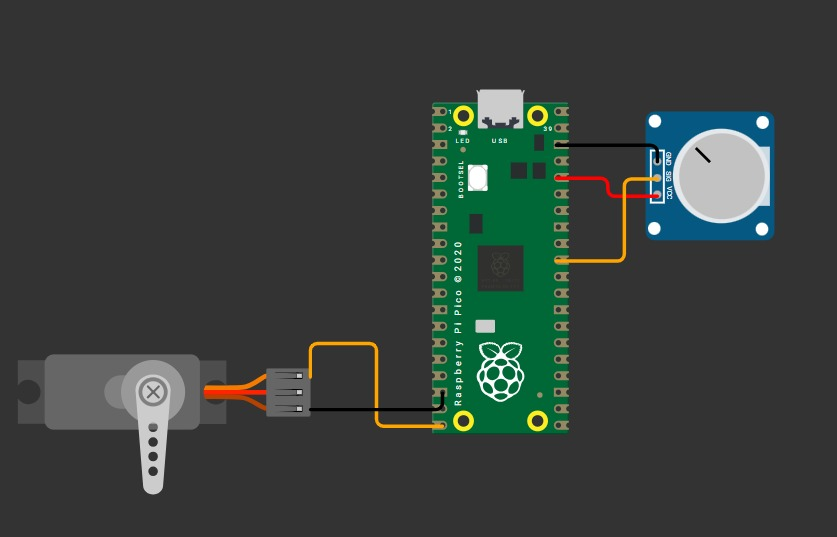

## Servo con ADC

El potenciómetro funcionará como un control manual que permitirá variar la posición del servomotor de manera proporcional.

El valor analógico leído por el ADC (convertidor analógico-digital) del Arduino será mapeado a un rango de 0 a 180 grados, haciendo que el eje del servo se mueva suavemente conforme se gira el potenciómetro.

---

### Esquemático de conexión 

Esquemático del circuito usado durante la actividad ADC con Servo.



---

### Código

```C++

#include <stdio.h>
#include "pico/stdlib.h"
#include "hardware/adc.h"
 
// Configurar el canal ADC a usar
#define ADC_INPUT 0 // canal 0
// número de muestras para promediar
#define N_muestras 16
 
int main() {
    stdio_init_all();
    adc_init();
    // Configura el pin GPIO correspondiente como entrada ADC
    adc_gpio_init(26); // GPIO26 suele mapear a ADC0 en Pico 2
    // Seleccionar canal
    adc_select_input(ADC_INPUT);
 
    // -- Variables --
    uint16_t buffer[N_muestras];
    uint32_t sum = 0; 
    uint8_t  indice = 0;              // proxima posicion a sobrescribir
    uint8_t  cuenta = 0;            // numero de muestras llenas hasta N_muestras
 
    while (true) {
        uint16_t adc = adc_read(); // 12 bits alineados a 0..4095
        if (cuenta < N_muestras) {
            // llenar buffer inicialmente
            buffer[indice] = adc;
            sum += adc;
            cuenta++;
            indice++;
        } else {
            // buffer lleno, proceder con media movil
            sum -= buffer[indice];         // restar valor viejo
            buffer[indice] = adc;          // agregar nuevo valor al buffer
            sum += adc;                 // sumar nuevo valor al total
            // Avance en el buffer circular
            indice++;
            if (indice >= N_muestras) indice = 0;
            // calcular promedio
            uint16_t promedio = sum / N_muestras;
 
            printf("%u\n", promedio);
            sleep_ms(10);
            if (promedio < 450) promedio = 0;           // No permitir valores negativos
            if (promedio > 3900) promedio = 100;     // No permitir valores mayores a 4095
 
            int porcentaje = (promedio * 100) / 3900;
 
            printf("Porcentaje de luz: %d%%\n", porcentaje);
        }
 
    }
 
}

```

### Video del Funcionamiento: ADC Luxometro

<iframe width="560" height="315" src="https://www.youtube.com/embed/8hLURUSWa2w?si=fcIH6MU7EZkM-anw" title="YouTube video player" frameborder="0" allow="accelerometer; autoplay; clipboard-write; encrypted-media; gyroscope; picture-in-picture; web-share" referrerpolicy="strict-origin-when-cross-origin" allowfullscreen></iframe>