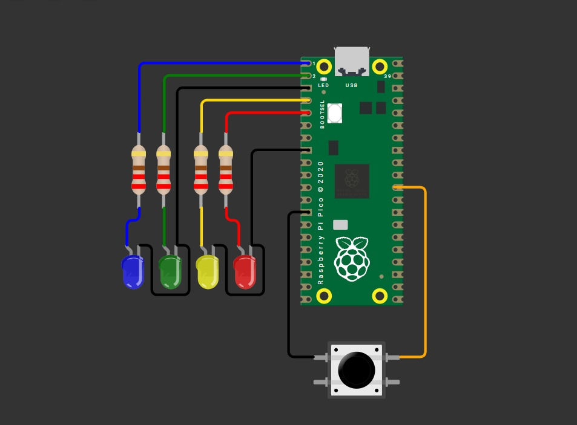

## Outputs Basicos

---

### Esquemático de conexión

Esquemático del circuito usado durante la actividad.



---

### Contador en Binario del 0 al 15

En cuatro leds debe mostrarse cada segundo la representacion binaria del 0 al 15.

#### Código
``` codigo
C++

#include "pico/stdlib.h"
#include "hardware/structs/sio.h"

#define LED_1 0
#define LED_2 1
#define LED_3 2
#define LED_4 3

int main() {
    // 1) Máscara con varios pines
    const uint32_t MASK = (1u<<LED_1) | (1u<<LED_2) | (1u<<LED_3) | (1u<<LED_4);

    // 2) Asegura función SIO en cada pin (necesario una sola vez)
    gpio_init(LED_1);
    gpio_init(LED_2);
    gpio_init(LED_3);
    gpio_init(LED_4);

    // 3) Dirección: salida (OE=1) para TODOS los pines con UNA sola instrucción
    sio_hw->gpio_oe_set = MASK;

    while (true)
    {
        for (int i = 0; i < 16; i++)
        {
            sio_hw->gpio_clr = MASK;

            sio_hw->gpio_set = (i << LED_1); 

            sleep_ms(300);

        }
        
    }
    
}
```

---

#### Video del Funcionamiento: Conteo Binario


---

### Barrido de LEDs

Correr un “1” por cuatro LEDs P0..P3 y regresar.

---

#### Código

``` codigo

c++

#include "pico/stdlib.h"
#include "hardware/structs/sio.h"

#define LED_1 0
#define LED_2 1
#define LED_3 2
#define LED_4 3

int main() {
    // Máscara de pines
    const uint32_t MASK = (1u<<LED_1) | (1u<<LED_2) | (1u<<LED_3) | (1u<<LED_4);

    // Inicialización de pines
    gpio_init(LED_1);
    gpio_init(LED_2);
    gpio_init(LED_3);
    gpio_init(LED_4);

    // Configurarlos como salida
    sio_hw->gpio_oe_set = MASK;

    int led_on = 0;
    int direc = 1;

    while (true) {
        
        sio_hw->gpio_clr = MASK;

        sio_hw->gpio_set = (1u << led_on);

        sleep_ms(200);

        led_on += direc;

        if (led_on == 3) direc = -1;
        else if (led_on == 0) direc = 1;
    }
}

```
---

#### Video del Funcionamiento: Ping Pong


---

### Secuencia en Código Grey

Representar la secuencia de Grey con 4 LEDs.

---

#### Código

``` codigo

c++

#include "pico/stdlib.h"
#include "hardware/structs/sio.h"

#define PIN_A 0
#define PIN_B 1
#define PIN_C 2
#define PIN_D 3

int main() {

    // 2) Asegura función SIO en cada pin (necesario una sola vez)
    gpio_init(0);
    gpio_init(1);
    gpio_init(2);
    gpio_init(3);
    // 3) Dirección: salida (OE=1) para TODOS los pines con UNA sola instrucción

    uint32_t cont=0;

    
    sio_hw->gpio_oe_set = (1 << PIN_A);
    sio_hw->gpio_oe_set = (1 << PIN_B);
    sio_hw->gpio_oe_set = (1 << PIN_C);
    sio_hw->gpio_oe_set = (1 << PIN_D);

    while (true) {
    
        uint32_t sec = cont ^ (cont >> 1);

        if (sec&0x1){
            gpio_put(PIN_A,1);
        }

        else{
            gpio_put(PIN_A,0);
        }
        
        if (sec&0x2){
            gpio_put(PIN_B,1);
        }

        else {
            gpio_put(PIN_B,0);
        }

        if (sec&0x4){
            gpio_put(PIN_C,1);	
        }

        else{
            gpio_put(PIN_C,0);
        }

        if (sec&0x8){
            gpio_put(PIN_D,1);		
        }

        else{
            gpio_put(PIN_D,0);
        }

        cont++;

        sleep_ms(500);
    }
}

```

---

#### Video del Funcionamiento: Patrón Gray