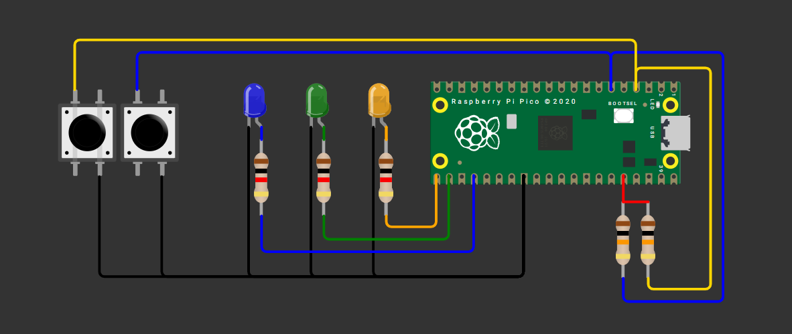

## Imputs

---

### Compuertas Lógicas AND, OR y XOR

Compuertas básicas AND / OR / XOR con 2 botones qué debe hacer: Con dos botones A y B (pull-up; presionado=0) enciende tres LEDs que muestren en paralelo los resultados de AND, OR y XOR. En el video muestra las 4 combinaciones (00, 01, 10, 11).

---

#### Esquemátco de conexión Compuertas Lógicas

Esquemático del circuito usado durante la actividad Compuertas Lógicas.



---

#### Código

``` codigo
C++

#include "pico/stdlib.h"
#include "hardware/structs/sio.h"

#define Boton_1 2
#define Boton_2 4
#define LED_1 18
#define LED_2 17
#define LED_3 16

int main() {

    gpio_init(Boton_1);
    gpio_set_dir(Boton_1, false);

    gpio_init(Boton_2);
    gpio_set_dir(Boton_2, false);

    gpio_init(LED_1);
    gpio_set_dir(LED_1, true);

    gpio_init(LED_2);
    gpio_set_dir(LED_2, true);

    gpio_init(LED_3);
    gpio_set_dir(LED_3, true);

    while (true) {
        bool b1 = gpio_get(Boton_1);
        bool b2 = gpio_get(Boton_2);

        if (!b1 && !b2) {
            gpio_put(LED_1, 1);
        } else {
            gpio_put(LED_1, 0);
        }

        if (!b1 || !b2) {
            gpio_put(LED_2, 1);
        } else {
            gpio_put(LED_2, 0);
        }

        if ((b1 && !b2) || (!b1 && b2)) {
            gpio_put(LED_3, 1);
        } else {
            gpio_put(LED_3, 0);
        }

        sleep_ms(10); 
    }
}

```

---

#### Video del Funcionamiento: Compuertas Lógicas


---