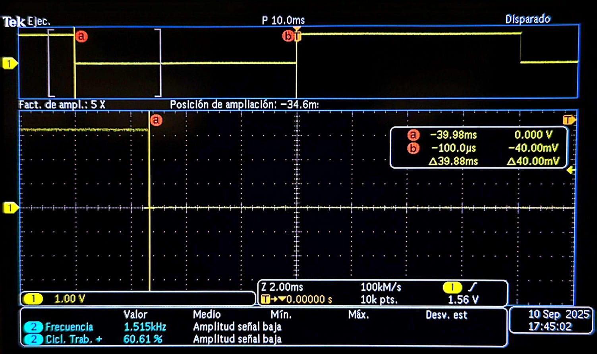
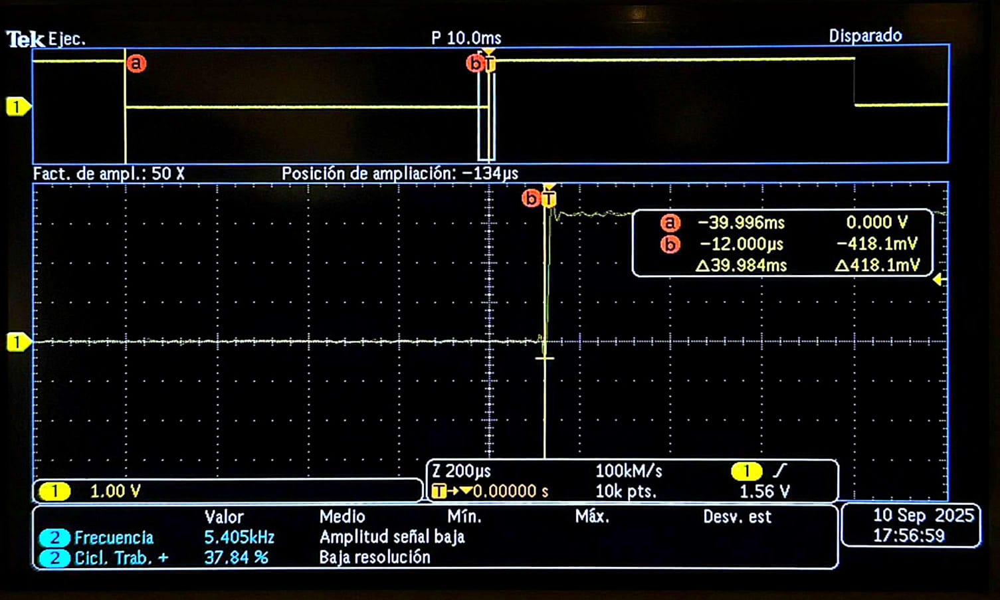

## Desfase de Tiempo con Temporizadores

---

### Esquemático de conexión 

Esquemático del circuito usado durante la actividad.


---

### Medición en osciloscopio del periodo y jitter usando ALARM0 (modo µs)

Genera una onda cuadrada por toggle de un pin de salida en la ISR de ALARM0, con rearme acumulativo y periodo nominal definido por ti (p. ej., 100 µs–5 ms). Mide con osciloscopio:

- Periodo promedio y tolerancia.
- Jitter pico-a-pico y, si tu equipo lo permite, RMS.
- Describe la configuración del osciloscopio (acoplamiento, escala de tiempo/voltaje, modo de medición). No cambiar la resolución del timer (mantener modo µs).

---

#### Código

Blink con timer (SDK alto nivel)

``` codigo
C++

#include "pico/stdlib.h"
#include "pico/time.h"

#define LED_PIN 0
static const int BLINK_MS = 40;  // <-- ajusta tu periodo aquí

bool blink_cb(repeating_timer_t *t) {
    static bool on = false;
    gpio_put(LED_PIN, on = !on);
    return true; // seguir repitiendo la alarma
}

int main() {
    stdio_init_all();

    gpio_init(LED_PIN);
    gpio_set_dir(LED_PIN, true);

    repeating_timer_t timer;
    // Programa una interrupción periódica cada BLINK_MS:
    add_repeating_timer_ms(BLINK_MS, blink_cb, NULL, &timer);

    while (true) {
        // El trabajo "pesado" debería ir aquí (no en la ISR).
        tight_loop_contents();
    }
}

```
#### Resultado en el Osciloscópio 



La señal obtenida tuvo un periodo promedio de 79.76 ms contra el periodo esperado de 80 ms dando como resultado una tolerancia del 0.3%, con un jitter aproximado de 200 µs y un voltaje de 1.54 v.

El osciloscópio se configuró con acoplamiento DC, 10 ms/div (zoom 2 ms/div), 1.0 V/div, cursores en tiempo, trigger por flanco.

---

### Comparar jitter/precisión con osciloscopio: modo µs vs modo ciclos

Genera una señal por toggle en la ISR de ALARM0, primero en modo µs y luego en modo ciclos de clk_sys (mismo periodo nominal). En ambos casos:

- Usa rearme acumulativo.
- Mantén el resto del código idéntico.
- Con el osciloscopio, mide y registra para cada modo:
- Periodo promedio y desviación respecto al nominal.
- Jitter pico-a-pico y/o RMS.
- Compara resultados y discute el compromiso entre resolución de tick y horizonte de programación.

---

#### Código

Para la comparación se usó el código anterior y el siguiente:

Blink con timer de sistema (bajo nivel)

``` codigo
C++

// Blink con timer de sistema (bajo nivel): programando ALARM0 e IRQ
#include "pico/stdlib.h"
#include "hardware/irq.h"
#include "hardware/structs/timer.h"

#define LED_PIN       0
#define ALARM_NUM     1  // usaremos la alarma 1

// Calcula el número de IRQ para esa alarma 
#define ALARM_IRQ     timer_hardware_alarm_get_irq_num(timer_hw, ALARM_NUM)

static volatile uint32_t next_deadline;   // próximo instante (en us) en 32 bits bajos
// Por defecto el timer cuenta µs (no cambiamos la fuente).
static volatile uint32_t intervalo_us = 40000u;    // periodo en microsegundos

void on_alarm_irq(void) {
    // 1) Limpiar el flag de la alarma
    hw_clear_bits(&timer_hw->intr, 1u << ALARM_NUM);

    // 2) Hacer el trabajo toggle LED
    sio_hw->gpio_togl = 1u << LED_PIN;

    // 3) Rearmar la siguiente alarma con "deadline acumulativo"
    next_deadline += intervalo_us;
    timer_hw->alarm[ALARM_NUM] = next_deadline;
}

int main() {
    stdio_init_all();

    // Configura el LED
    gpio_init(LED_PIN);
    gpio_set_dir(LED_PIN, true);

    // "now" = 32 bits bajos del contador (tiempo en µs)
    uint32_t now_us = timer_hw->timerawl;          // lectura 32b (low) del contador
    next_deadline = now_us + intervalo_us;         // primer deadline

    // Programa la alarma
    timer_hw->alarm[ALARM_NUM] = next_deadline;

    // Crea un handler exclusivo para ligar el callback a la IRQ de la alarma
    irq_set_exclusive_handler(ALARM_IRQ, on_alarm_irq);
    // Habilita dentro del periférico TIMER la fuente de interrupción para la alarma ALARM_NUM inte = interrupt enable
    hw_set_bits(&timer_hw->inte, 1u << ALARM_NUM);
    //Habilita la IRQ en el NVIC (controlador de interrupciones del núcleo)
    irq_set_enabled(ALARM_IRQ, true);

    while (true) {
        // Mantén el bucle principal libre; lo pesado va aquí, no en la ISR
        tight_loop_contents();
    }
}

```

---

#### Resultado del Osciloscópio



La señal  del segundo código tuvo un periodo promedio de 79.968 ms contra el periodo esperado de 80 ms dando como resultado una tolerancia del 0.04%, con un jitter aproximado de 200 µs y un voltaje de 1.54 v.

Se usó la misma configuración en el osciloscópio del ejercicio anterior.

---

#### Resultados de la Comparación

Comparando ambas señales de 80 ms de período ideal, la segunda señal es más precisa con un período promedio de 79.968 ms con una tolerancia 0.04 % frente a los 79.76 ms de la primera y una tolerancia 0.3 %, mientras que el jitter y el voltaje son idénticos en ambas, 200 µs y 1.54 V respectivamente. Esto indica que, aunque ambas son estables, la segunda ofrece una mayor exactitud temporal.