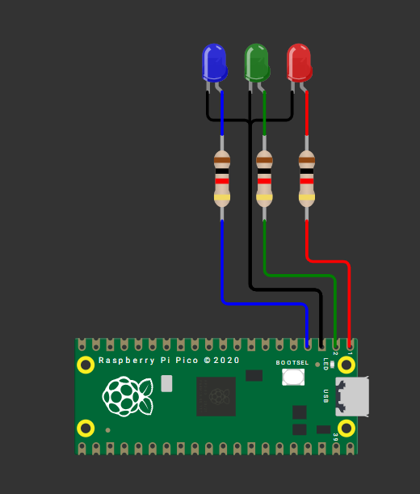
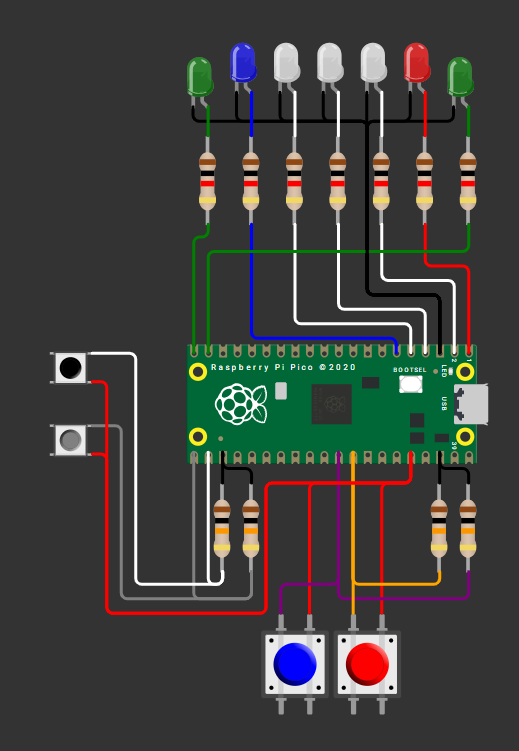

## Ejercicio de Programación Timers

---

### Cuatro Alarmas / Cuatro LEDs a Distintas Frecuencias

Configurar ALARM0..ALARM3 del timer de sistema en modo µs. Cada alarma controla un LED distinto con un periodo propio. 

Se intento activar la cuarta alarma “ALARMA3” pero en ningún momento esta alarma funciono, por lo cual solo se implementaron 3 alarmas. 

---

#### Esquemático de conexión LEDs Diferentes Frecuencias

Esquemático del circuito usado durante la actividad LEDs a diferentes frecuencias.



---

#### Código

``` codigo
C++

#include "pico/stdlib.h"
#include "hardware/irq.h"
#include "hardware/structs/timer.h"
#include "hardware/gpio.h"

#define LED0_PIN     0   // LED integrado
#define LED1_PIN     1      
#define LED2_PIN     2           // LED externo en GPIO 0

#define ALARM0_NUM   0
#define ALARM1_NUM   1
#define ALARM2_NUM   2

#define ALARM0_IRQ   timer_hardware_alarm_get_irq_num(timer_hw, ALARM0_NUM)
#define ALARM1_IRQ   timer_hardware_alarm_get_irq_num(timer_hw, ALARM1_NUM)
#define ALARM2_IRQ   timer_hardware_alarm_get_irq_num(timer_hw, ALARM2_NUM)


// Próximos "deadlines" (32 bits bajos en µs) y sus intervalos en µs
static volatile uint32_t next0_us, next1_us , next2_us;
static const uint32_t INTERVALO0_US = 250000u;
static const uint32_t INTERVALO1_US = 400000u;
static const uint32_t INTERVALO2_US = 800000u;

// ISR para ALARM0
static void on_alarm0_irq(void) {
    hw_clear_bits(&timer_hw->intr, 1u << ALARM0_NUM);
    sio_hw->gpio_togl = 1u << LED0_PIN;
    next0_us += INTERVALO0_US;
    timer_hw->alarm[ALARM0_NUM] = next0_us;
}

// ISR para ALARM1
static void on_alarm1_irq(void) {
    hw_clear_bits(&timer_hw->intr, 1u << ALARM1_NUM);
    sio_hw->gpio_togl = 1u << LED1_PIN;
    next1_us += INTERVALO1_US;
    timer_hw->alarm[ALARM1_NUM] = next1_us;
}

// ISR para ALARM2
static void on_alarm2_irq(void) {
    hw_clear_bits(&timer_hw->intr, 1u << ALARM2_NUM);
    sio_hw->gpio_togl = 1u << LED2_PIN;
    next2_us += INTERVALO2_US;
    timer_hw->alarm[ALARM2_NUM] = next2_us;
}

int main() {

    gpio_init(LED0_PIN);
    gpio_set_dir(LED0_PIN, GPIO_OUT);
    gpio_put(LED0_PIN, 0);

    gpio_init(LED1_PIN);
    gpio_set_dir(LED1_PIN, GPIO_OUT);
    gpio_put(LED1_PIN, 0);

    gpio_init(LED2_PIN);
    gpio_set_dir(LED2_PIN, GPIO_OUT);
    gpio_put(LED2_PIN, 0);

    // Timer de sistema en microsegundos (por defecto source = 0)
    timer_hw->source = 0u;

    uint32_t now_us = timer_hw->timerawl;

    // Primeros deadlines
    next0_us = now_us + INTERVALO0_US;
    next1_us = now_us + INTERVALO1_US;
    next2_us = now_us + INTERVALO2_US;

    // Programa ambas alarmas
    timer_hw->alarm[ALARM0_NUM] = next0_us;
    timer_hw->alarm[ALARM1_NUM] = next1_us;
    timer_hw->alarm[ALARM2_NUM] = next2_us;

    // Limpia flags pendientes antes de habilitar
    hw_clear_bits(&timer_hw->intr, (1u << ALARM0_NUM) | (1u << ALARM1_NUM) | (1u << ALARM2_NUM));

    // Registra handlers exclusivos para cada alarma
    irq_set_exclusive_handler(ALARM0_IRQ, on_alarm0_irq);
    irq_set_exclusive_handler(ALARM1_IRQ, on_alarm1_irq);
    irq_set_exclusive_handler(ALARM2_IRQ, on_alarm2_irq);

    // Habilita fuentes de interrupción en el periférico TIMER
    hw_set_bits(&timer_hw->inte, (1u << ALARM0_NUM) | (1u << ALARM1_NUM) | (1u << ALARM2_NUM));

    // Habilita ambas IRQ en el NVIC
    irq_set_enabled(ALARM0_IRQ, true);
    irq_set_enabled(ALARM1_IRQ, true);
    irq_set_enabled(ALARM2_IRQ, true);

    // Bucle principal: todo el parpadeo ocurre en las ISRs
    while (true) {
        tight_loop_contents();
    }
}
```

---

#### Video del Funcionamiento: LEDs a Distintas Frecuencias


---

### Ping Pong con Diferentes Velocidad

Modificar su pong, para tener dos botones adicionales, que suban y bajen la velocidad del juego sin delay.

---

#### Esquemático de conexión Ping Pong Velocidades

Esquemático del circuito usado durante la actividad Ping Pong con distintas velocidades.



---

#### Código

``` codigo
C++

#include "pico/stdlib.h"
#include "hardware/structs/sio.h"
#include "pico/time.h"

#define LED_1 0
#define LED_2 1
#define LED_3 2
#define LED_4 3
#define LED_5 4

#define LED_G1 14
#define LED_G2 15

#define Boton_Len 16
#define Boton_Rap 17

#define Boton_1 27
#define Boton_2 26

int led_on = 2; // led con el que comienza el juego
int direc = 0; // para la direccion +1 izquierda, -1 derecha, negativo porque al comenzar el juego comenzamos a la izquierda

// 0 es no presionado, 1 es presionado
int boton_d = 0;
int boton_i = 0;

volatile int velocidad = 450; // velocidad inicial de la pelota
const int velocidad_max = 150; 
const int velocidad_min = 1050; 
const int cambio = 150; 

//esto pasa cuando alguno de los botones se presiono
void juan_perez(uint gpio, uint32_t events){
    if (gpio == Boton_1) boton_d = 1;
    if (gpio == Boton_2) boton_i = 1;
 
    if (gpio == Boton_Len && velocidad <= velocidad_min) {
        velocidad += cambio;
        cancel_repeating_timer(&timer);
        add_repeating_timer_ms(velocidad, Juego_Ping_Pong, NULL, &timer);
    }
    if (gpio == Boton_Rap && velocidad >= velocidad_max) {
        velocidad -= cambio;
        cancel_repeating_timer(&timer);
        add_repeating_timer_ms(velocidad, Juego_Ping_Pong, NULL, &timer);
    }
}

bool Juego_Ping_Pong(repeating_timer_t *t) {
            // Apagar los leds para que no se queden encendidos siempre
        for (int i = LED_1; i <= LED_5; i++) gpio_put(i, 0);

        // Encender el led actual
        gpio_put(led_on, 1);

        if (led_on == 0){ // si el led que esta encendido es el 0, quiere decir que la pelota llego al final izquierdo
            if(boton_d){  // si se presiona el boton se cambia la direccion de la pelota a la izquierda
                direc = 1;
            } else {
                gpio_put(LED_G2, 1); sleep_ms(500); // Si no se presiono, el jugador perdio y enciende el led del jugador 2
                gpio_put(LED_G2, 0); sleep_ms(500);
                gpio_put(LED_G2, 1); sleep_ms(500);
                gpio_put(LED_G2, 0); sleep_ms(500);
                gpio_put(LED_G2, 1); sleep_ms(500);
                gpio_put(LED_G2, 0);
                led_on = 1;
                direc = 1; // Ahora la pelota va a la izquierda

            }
            boton_d = 0;  // Resetear la variable del boton derecho
        }
        else if (led_on == 4) {
            if(boton_i){
                direc = -1;
            } else {
                gpio_put(LED_G1, 1); sleep_ms(500);
                gpio_put(LED_G1, 0); sleep_ms(500);
                gpio_put(LED_G1, 1); sleep_ms(500);
                gpio_put(LED_G1, 0); sleep_ms(500);
                gpio_put(LED_G1, 1); sleep_ms(500);
                gpio_put(LED_G1, 0);
                led_on = 3;
                direc = -1;

            }
            boton_i = 0;  
        }

        // Actualizar el led actual
    led_on += direc;
    return true; // Indica que el temporizador debe reiniciarse
    
}

int main() {

    // Poner los leds como salida
    gpio_init(0); gpio_set_dir(0, 1);
    gpio_init(1); gpio_set_dir(1, 1);
    gpio_init(2); gpio_set_dir(2, 1);
    gpio_init(3); gpio_set_dir(3, 1);
    gpio_init(4); gpio_set_dir(4, 1);


    // Salida
    gpio_init(LED_G1); gpio_set_dir(LED_G1,1);
    gpio_init(LED_G2); gpio_set_dir(LED_G2,1);

    // Entrada
    gpio_init(Boton_1); gpio_set_dir(Boton_1,0); 
    gpio_init(Boton_2); gpio_set_dir(Boton_2,0);

    gpio_init(Boton_Len); gpio_set_dir(Boton_Len,0);
    gpio_init(Boton_Rap); gpio_set_dir(Boton_Rap,0);

    // GPIO_IRQ_EDGE_RISE significa que se activa la interrupcion cuando el boton se presiona y true es para activar la interrupcion
    gpio_set_irq_enabled_with_callback(Boton_1, GPIO_IRQ_EDGE_RISE, true, &juan_perez);
    gpio_set_irq_enabled(Boton_2, GPIO_IRQ_EDGE_RISE, true);
    gpio_set_irq_enabled(Boton_Len, GPIO_IRQ_EDGE_RISE, true);
    gpio_set_irq_enabled(Boton_Rap, GPIO_IRQ_EDGE_RISE, true);

    repeating_timer_t timer;

    while (direc == 0) { // mientras que no se haya presionado ningun boton, el led de en medio esta encendido
      gpio_put(LED_3, 1);
      if (boton_d) {      //cuando el boton derecho se presiona la variable direc es 1, por lo que la pelota va a la izquierda        
          direc = 1;  
          boton_d = 0;
      }
      if (boton_i) {
          direc = -1;  //cuando el boton derecho se presiona la variable direc es -1, por lo que la pelota va a la derecha
          boton_i = 0; //resetear la variable para que no siga detectando que el boton esta presionado
      }
      sleep_ms(10);
    }

    add_repeating_timer_ms(velocidad, Juego_Ping_Pong, NULL, &timer); // Iniciar el temporizador con la velocidad inicial

    while (true) {
        tight_loop_contents(); // Mantiene el programa corriendo
    }
}
```

---

#### Video del Funcionamiento: Ping Pong con Diferentes Velocidades